We need need to evaluate options to migrate away from mocha.

We want to be efficient with our CI servers, developer machines and developer time.
Thus the first thing is the ability to run test files concurrently - only ava and jest does that.
Second is the actual performance of running the tests in our codebase, which already has many and will have more test files, many of which have very many generated tests.

So obviously best way to answer that is synthetic benchmarks with ava and jest side-by-side!
First basic step is to run one test file with many empty tests.
You can find the scripts in [this repo](todo).
Below are the results, which conclude that jest is significantly inferior and our benchmarks end early.

Notes:
* default `max-old-space-size` of Node.js is 512MB.
* the results are for Linux 4.19.0 kernel on `Intel(R) Core(TM) i7-7820HQ` CPU with `32GB` of RAM
* in the benchmarks ava test reporter is normal (names of all tests are printed), while jest is silenced (no test name output)
* to compile the images below, run `npm start` (it will take time)

# many files with one test

Both ava and jest are set to run 4 files concurrently.

## max memory used

| N    | ava     | jest     |
| ---- | ------- | -------- |
| 1    | 110.668 | 128.988  |
| 2    | 150.449 | 362.699  |
| 4    | 228.789 | 512.352  |
| 8    | 227.516 | 517.758  |
| 16   | 231.574 | 529.730  |
| 32   | 223.914 | 591.102  |
| 64   | 231.000 | 679.402  |
| 128  | 247.895 | 887.449  |
| 256  | 247.984 | 1148.477 |
| 512  | 255.617 | 1555.266 |
| 1024 | 267.273 | 2135.773 |

## duration

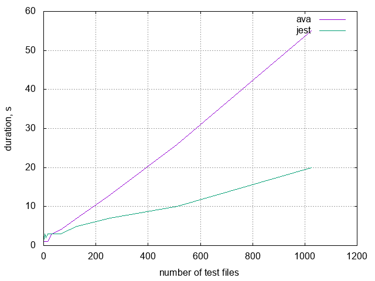
| N    | ava | jest |
| ---- | --- | ---- |
| 1    | 1   | 1    |
| 2    | 1   | 2    |
| 4    | 1   | 3    |
| 8    | 1   | 2    |
| 16   | 1   | 3    |
| 32   | 3   | 3    |
| 64   | 4   | 3    |
| 128  | 7   | 5    |
| 256  | 13  | 7    |
| 512  | 26  | 10   |
| 1024 | 55  | 20   |

## max mean memory used per file

| N    | ava                      | jest                     |
| ---- | ------------------------ | ------------------------ |
| 1    | 110.66800000000000000000 | 128.98800000000000000000 |
| 2    | 75.22450000000000000000  | 181.34950000000000000000 |
| 4    | 57.19725000000000000000  | 128.08800000000000000000 |
| 8    | 28.43950000000000000000  | 64.71975000000000000000  |
| 16   | 14.47337500000000000000  | 33.10812500000000000000  |
| 32   | 6.99731250000000000000   | 18.47193750000000000000  |
| 64   | 3.60937500000000000000   | 10.61565625000000000000  |
| 128  | 1.93667968750000000000   | 6.93319531250000000000   |
| 256  | .96868750000000000000    | 4.48623828125000000000   |
| 512  | .49925195312500000000    | 3.03762890625000000000   |
| 1024 | .26100878906250000000    | 2.08571582031250000000   |

## mean duration per file

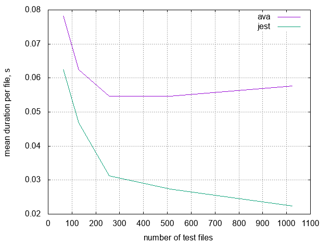
| N    | ava                    | jest                   |
| ---- | ---------------------- | ---------------------- |
| 1    | 1.00000000000000000000 | 1.00000000000000000000 |
| 2    | .50000000000000000000  | 1.00000000000000000000 |
| 4    | .25000000000000000000  | .75000000000000000000  |
| 8    | .12500000000000000000  | .25000000000000000000  |
| 16   | .06250000000000000000  | .18750000000000000000  |
| 32   | .09375000000000000000  | .09375000000000000000  |
| 64   | .06250000000000000000  | .04687500000000000000  |
| 128  | .05468750000000000000  | .03906250000000000000  |
| 256  | .05078125000000000000  | .02734375000000000000  |
| 512  | .05078125000000000000  | .01953125000000000000  |
| 1024 | .05371093750000000000  | .01953125000000000000  |

# one file with many tests

## search for maximum number of tests

### maximum number of tests per max-old-space-size

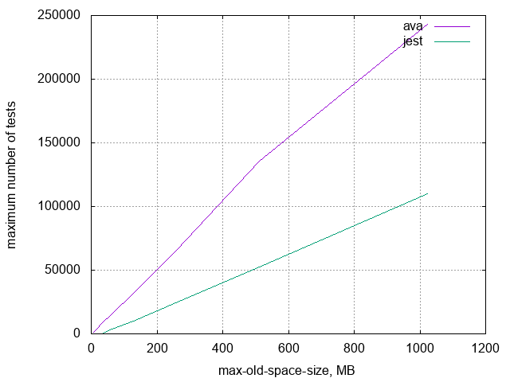
| RAM  | ava    | jest   |
| ---- | ------ | ------ |
| 8    | 1100   | 2      |
| 16   | 3878   | 2      |
| 32   | 8206   | 2      |
| 64   | 15518  | 3466   |
| 128  | 32177  | 10283  |
| 256  | 64798  | 24427  |
| 512  | 135555 | 52735  |
| 1024 | 243167 | 110287 |

### time to run maximum number of tests

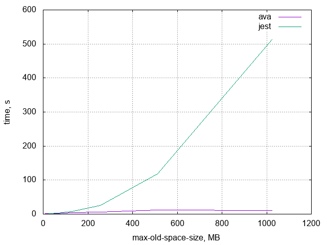
| RAM  | ava | jest |
| ---- | --- | ---- |
| 8    | 1   | 0    |
| 16   | 1   | 0    |
| 32   | 2   | 1    |
| 64   | 1   | 3    |
| 128  | 4   | 8    |
| 256  | 6   | 26   |
| 512  | 12  | 119  |
| 1024 | 11  | 513  |

### memory per single test, >=64MB

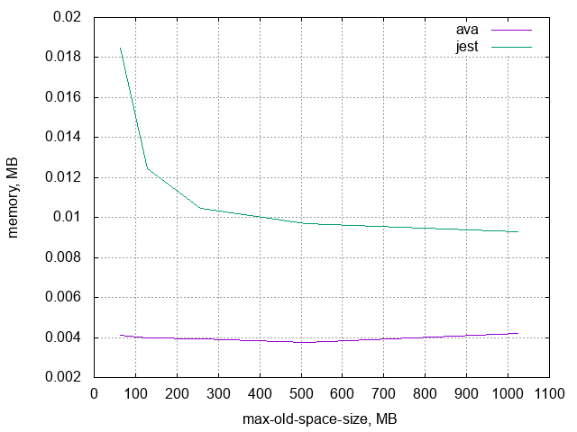
| RAM  | ava                   | jest                    |
| ---- | --------------------- | ----------------------- |
| 8    | .00727272727272727272 | 4.00000000000000000000  |
| 16   | .00412583806085611139 | 8.00000000000000000000  |
| 32   | .00389958566902266634 | 16.00000000000000000000 |
| 64   | .00412424281479572109 | .01846508944027697634   |
| 128  | .00397799670572147807 | .01244772926188855392   |
| 256  | .00395073922034630698 | .01048020632906210341   |
| 512  | .00377706466010106598 | .00970892196833222717   |
| 1024 | .00421109772296405351 | .00928486585000952061   |

### time per single test, >=64MB

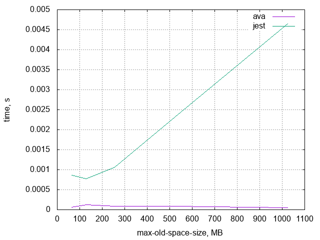
| RAM  | ava                   | jest                  |
| ---- | --------------------- | --------------------- |
| 8    | .00090909090909090909 | 0                     |
| 16   | .00025786487880350696 | 0                     |
| 32   | .00024372410431391664 | .5                    |
| 64   | .00006444129398118314 | .00086555106751298326 |
| 128  | .00012431239705379618 | .00077798307886803462 |
| 256  | .00009259545047686656 | .00106439595529536987 |
| 512  | .00008852495297111873 | .00225656584810846686 |
| 1024 | .00004523640132090291 | .00465150017681141022 |

## memory usage plot

Ava on the left, Jest on the right.

### 10000

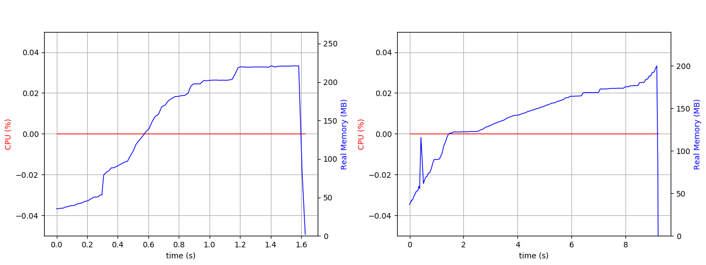

### 25000

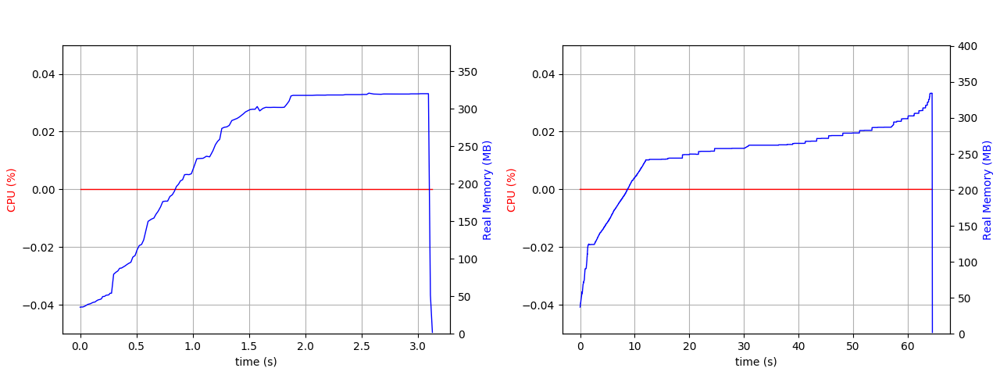

### 50000

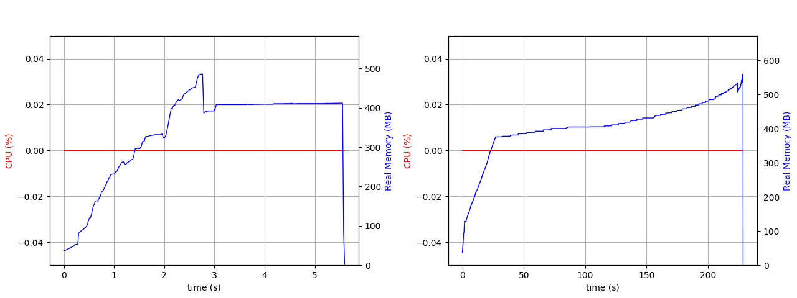

### 52735 (max for jest)

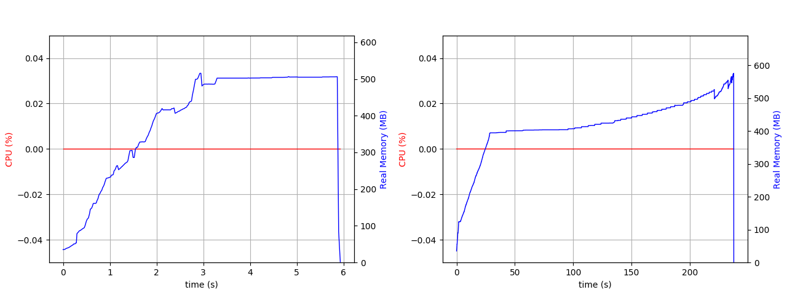

### 135555 (max for ava)

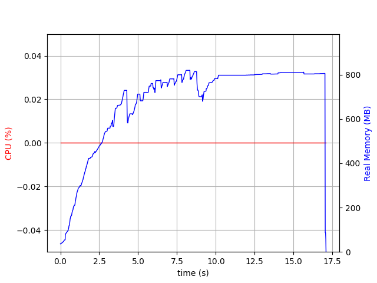

## time to run

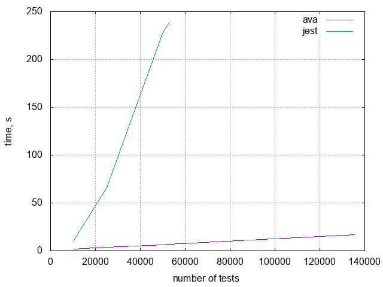
| tests  | ava | jest |
| ------ | --- | ---- |
| 10000  | 2   | 10   |
| 25000  | 4   | 66   |
| 50000  | 6   | 229  |
| 52735  | 7   | 238  |
| 135555 | 17  | -    |
