## !!! THIS IS A TEST OF jest-circus!!! Ignore, the conclusions, just start at [raw results](#node). Everywhere below where AVA is mentioned, it is actually jest with jest-circus runner


We need need to evaluate options to migrate away from mocha.

We want to be efficient with our CI servers, developer machines and developer time.
Thus the first thing is the ability to run test files concurrently - only AVA and Jest does that.
Second is the actual performance of running the tests in our codebase, which already has many and will have more test files, many of which have very many generated tests.

So obviously best way to answer that is synthetic benchmarks with AVA and Jest side-by-side!
We run one test file with many empty tests, followed by many test files with one empty test.
You can find the scripts in [this repo](https://github.com/jakutis/ava-vs-jest).

Notes:
* the only features that Jest bundles and we use and thus need to add to AVA, are assertion library and JSDOM:
  * for assertion library, latest `chai` is used there
  * for JSDOM, latest `jsdom` is used there
* Node.js memory control is performed via the `max-old-space-size` argument, default is 512MB
* degree of parallelism for both AVA and Jest are set to 4
* in the benchmarks AVA test reporter is normal (names of all tests are printed), while Jest is silenced (no test name output)
* to compile the images below, run `npm start` (it will take time)

```

  Binaries:
    Node: 12.18.0 - ~/.nvm/versions/node/v12.18.0/bin/node
    Yarn: 1.22.4 - ~/.nvm/versions/node/v12.18.0/bin/yarn
    npm: 6.14.5 - ~/.nvm/versions/node/v12.18.0/bin/npm


  System:
    OS: Linux 4.19 Debian GNU/Linux 10 (buster) 10 (buster)
    CPU: (8) x64 Intel(R) Core(TM) i7-7820HQ CPU @ 2.90GHz
    Memory: 6.08 GB / 31.06 GB
    Container: Yes
    Shell: 5.0.3 - /bin/bash


  npmPackages:
    ava: 3.9.0 => 3.9.0 
    chai: 4.2.0 => 4.2.0 
    envinfo: 7.5.1 => 7.5.1 
    jest: 26.0.1 => 26.0.1 
    jest-circus: 26.0.1 => 26.0.1 
    jsdom: 16.2.2 => 16.2.2 
    react: 16.13.1 => 16.13.1 
    react-dom: 16.13.1 => 16.13.1 
```


Jump to:
- [Node.js environment test](#node)
- [JSDOM environment test](#jsdom)


Below are the results, which conclude:
- Jest is significantly inferior everywhere except in running many (more than 100) test files in parallel
- node+many files one test
  - Jest uses 3 times more memory (673MB vs. 235MB for 128 test files) ([see graph](#max-memory-used))
  - Jest is 1.5 times faster (3s vs. 4s for 64 test files, 5s vs. 8s for 128 test files, 10s vs. 14s for 256 test files) ([see graph](#duration))
- node+one file many tests
  - Jest uses 2 times more memory (can run 56624 tests vs. 136855 for 512MB of memory) ([see graph](#maximum-number-of-tests-per-max-old-space-size))
  - Jest is slower ([see graph](#time-to-run))
    - with 512MB of memory: 4 times slower for 10000 tests, 11 times slower for 25000 tests, 27 times slower for 50000 tests
    - aggressively spends time to run garbage collector ([see graphs](#memory-usage-plot))
    - [see graph](#time-to-run-maximum-number-of-tests) for maximum number of tests
      - with 128MB memory: 4 times slower for max tests
      - with 256MB memory: 8 times slower for max tests
      - with 512MB memory: 13 times slower for max tests 
- jsdom+many files one test
  - Jest uses 3 times more memory (1006MB vs. 393MB for 128 test files) ([see graph](#max-memory-used-1))
  - Jest is 6 times faster (4s vs. 14s for 64 test files, 6s vs. 27s for 128 test files, 8s vs. 55s for 256 test files) ([see graph](#duration-1))
- jsdom+one file many tests
  - Jest uses 2 times more memory (can run 47119 tests vs. 74706 for 512MB of memory) ([see graph](#maximum-number-of-tests-per-max-old-space-size-1))
  - Jest is slower ([see graph](#time-to-run-1))
    - with 512MB of memory: 4 times slower for 10000 tests, 11 times slower for 25000 tests
    - aggressively spends time to run garbage collector ([see graphs](#memory-usage-plot-1))
    - [see graph](#time-to-run-maximum-number-of-tests-1) for maximum number of tests
      - with 128MB memory: 2 times slower
      - with 256MB memory: 4 times slower
      - with 512MB memory: 19 times slower 

<a name="node"/></a>

# node

AVA test:
```javascript
const test = require('ava');
const { expect } = require('chai')

for (var i = 1; i <= Number(process.env.FATJEST_COUNT); i++) {
  test('product #' + i, t => {
    expect('hi').to.equal('hi')
    t.pass()
  })
}

```

Jest test:
```javascript
describe('product', () => {
  for (var i = 1; i <= Number(process.env.FATJEST_COUNT); i++) {
    test('works #' + i, () => {
      expect('hi').toBe('hi')
    })
  }
})

```

## many files with one test

Both AVA and Jest are set to run 4 files concurrently.

### max memory used

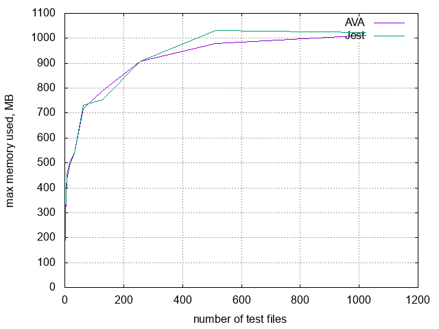
| files | AVA      | Jest     |
| ----- | -------- | -------- |
| 1     | 95.816   | 97.137   |
| 2     | 278.109  | 280.531  |
| 4     | 364.434  | 384.465  |
| 8     | 434.133  | 453.551  |
| 16    | 489.703  | 499.316  |
| 32    | 537.668  | 538.883  |
| 64    | 717.129  | 730.586  |
| 128   | 788.371  | 753.316  |
| 256   | 906.711  | 906.320  |
| 512   | 978.535  | 1030.676 |
| 1024  | 1010.934 | 1022.266 |


### duration

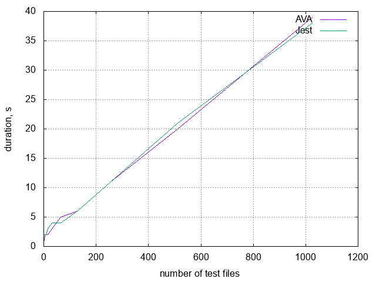
| files | AVA | Jest |
| ----- | --- | ---- |
| 1     | 1   | 2    |
| 2     | 1   | 2    |
| 4     | 2   | 2    |
| 8     | 2   | 2    |
| 16    | 2   | 3    |
| 32    | 3   | 4    |
| 64    | 5   | 4    |
| 128   | 6   | 6    |
| 256   | 11  | 11   |
| 512   | 20  | 21   |
| 1024  | 39  | 38   |


### max mean memory used per file

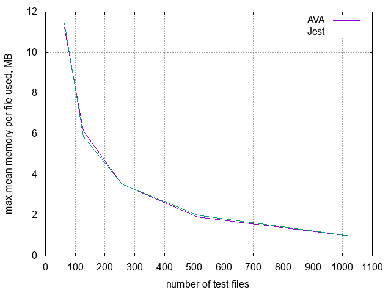
| files | AVA                      | Jest                     |
| ----- | ------------------------ | ------------------------ |
| 1     | 95.81600000000000000000  | 97.13700000000000000000  |
| 2     | 139.05450000000000000000 | 140.26550000000000000000 |
| 4     | 91.10850000000000000000  | 96.11625000000000000000  |
| 8     | 54.26662500000000000000  | 56.69387500000000000000  |
| 16    | 30.60643750000000000000  | 31.20725000000000000000  |
| 32    | 16.80212500000000000000  | 16.84009375000000000000  |
| 64    | 11.20514062500000000000  | 11.41540625000000000000  |
| 128   | 6.15914843750000000000   | 5.88528125000000000000   |
| 256   | 3.54183984375000000000   | 3.54031250000000000000   |
| 512   | 1.91120117187500000000   | 2.01303906250000000000   |
| 1024  | .98724023437500000000    | .99830664062500000000    |


### mean duration per file


| files | AVA                    | Jest                   |
| ----- | ---------------------- | ---------------------- |
| 1     | 1.00000000000000000000 | 2.00000000000000000000 |
| 2     | .50000000000000000000  | 1.00000000000000000000 |
| 4     | .50000000000000000000  | .50000000000000000000  |
| 8     | .25000000000000000000  | .25000000000000000000  |
| 16    | .12500000000000000000  | .18750000000000000000  |
| 32    | .09375000000000000000  | .12500000000000000000  |
| 64    | .07812500000000000000  | .06250000000000000000  |
| 128   | .04687500000000000000  | .04687500000000000000  |
| 256   | .04296875000000000000  | .04296875000000000000  |
| 512   | .03906250000000000000  | .04101562500000000000  |
| 1024  | .03808593750000000000  | .03710937500000000000  |


## one file with many tests

### search for maximum number of tests

#### maximum number of tests per max-old-space-size


| memory | AVA    | Jest   |
| ------ | ------ | ------ |
| 8      | 1      | 1      |
| 16     | 1      | 1      |
| 32     | 5860   | 1465   |
| 64     | 19531  | 4883   |
| 128    | 48095  | 12207  |
| 256    | 104491 | 27831  |
| 512    | 123778 | 58593  |
| 1024   | 123778 | 120116 |


#### time to run maximum number of tests


| memory | AVA | Jest |
| ------ | --- | ---- |
| 8      | 1   | 0    |
| 16     | 1   | 1    |
| 32     | 1   | 2    |
| 64     | 5   | 3    |
| 128    | 5   | 9    |
| 256    | 12  | 28   |
| 512    | 11  | 122  |
| 1024   | 11  | 816  |


#### memory per single test, >=64MB


| memory | AVA                     | Jest                    |
| ------ | ----------------------- | ----------------------- |
| 8      | 8.00000000000000000000  | 8.00000000000000000000  |
| 16     | 16.00000000000000000000 | 16.00000000000000000000 |
| 32     | .00546075085324232081   | .02184300341296928327   |
| 64     | .00327684194357687778   | .01310669670284661069   |
| 128    | .00266139931385798939   | .01048578684361431965   |
| 256    | .00244997176790345580   | .00919837591175308109   |
| 512    | .00413643781609009678   | .00873824518287167409   |
| 1024   | .00827287563218019357   | .00852509241066968597   |


#### time per single test, >=64MB

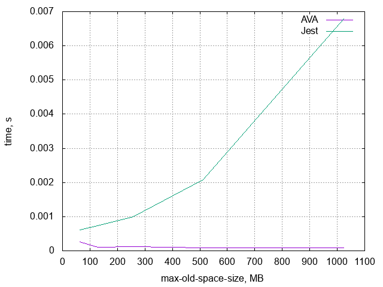
| memory | AVA                    | Jest                   |
| ------ | ---------------------- | ---------------------- |
| 8      | 1.00000000000000000000 | 0                      |
| 16     | 1.00000000000000000000 | 1.00000000000000000000 |
| 32     | .00017064846416382252  | .00136518771331058020  |
| 64     | .00025600327684194357  | .00061437640794593487  |
| 128    | .00010396091069757771  | .00073728188744163185  |
| 256    | .00011484242662047449  | .00100607236534799324  |
| 512    | .00008886878120506067  | .00208215998498114109  |
| 1024   | .00008886878120506067  | .00679343301475240600  |


### memory usage plot

When max-old-space-size is 512MB.
AVA on the left, Jest on the right. 

#### 10000


#### 25000

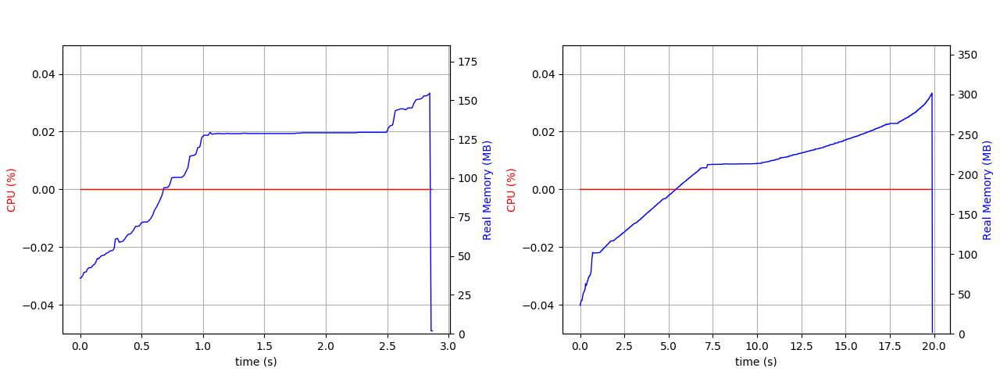

#### 50000


#### 58593 (max for Jest)


#### 123778 (max for AVA)


### time to run

When max-old-space-size is 512MB.

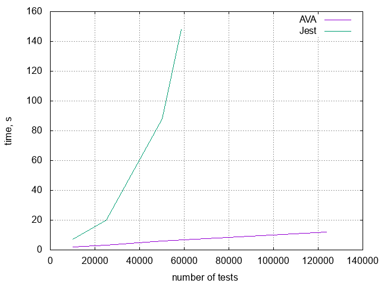
| tests  | AVA | Jest |
| ------ | --- | ---- |
| 10000  | 2   | 7    |
| 25000  | 3   | 20   |
| 50000  | 6   | 88   |
| 58593  | -   | 148  |
| 123778 | 12  | -    |


<a name="jsdom"/></a>

# jsdom

AVA test:
```javascript
const test = require('ava')
const { expect } = require('chai')
const React = require('react')
const { render, findDOMNode } = require('react-dom')
const { JSDOM } = require('jsdom')
global.window = (new JSDOM('<!doctype html><html><body></body></html>', {
  url: 'https://example.org/',
  referrer: 'https://example.com/',
  contentType: 'text/html',
  includeNodeLocations: true,
  storageQuota: 10000000
})).window
global.document = global.window.document

for (const key in global.window) {
  if (global.window.hasOwnProperty(key) && !(key in global)) {
    global[key] = global.window[key]
  }
}

for (var i = 1; i <= Number(process.env.FATJEST_COUNT); i++) {
  test('product #' + i, t => {
    const container = document.createElement('div')
    document.body.appendChild(container)
    const element = React.createElement('p', {}, 'hi')
    const component = render(element, container)
    const node = findDOMNode(component)
    expect(node.innerHTML).to.equal('hi')
    document.body.removeChild(container)
    t.pass()
  })
}

```

Jest test:
```javascript
const React = require('react')
const { render, findDOMNode } = require('react-dom')

describe('product', () => {
  for (var i = 1; i <= Number(process.env.FATJEST_COUNT); i++) {
    test('works #' + i, () => {
      const container = document.createElement('div')
      document.body.appendChild(container)
      const element = React.createElement('p', {}, 'hi')
      const component = render(element, container)
      const node = findDOMNode(component)
      expect(node.innerHTML).toBe('hi')
      document.body.removeChild(container)
    })
  }
})

```

## many files with one test

Both AVA and Jest are set to run 4 files concurrently.

### max memory used


| files | AVA      | Jest     |
| ----- | -------- | -------- |
| 1     | 134.738  | 135.719  |
| 2     | 390.168  | 401.176  |
| 4     | 555.746  | 557.098  |
| 8     | 556.266  | 591.914  |
| 16    | 604.465  | 633.730  |
| 32    | 714.984  | 779.020  |
| 64    | 936.086  | 1013.395 |
| 128   | 1032.570 | 1031.094 |
| 256   | 1197.586 | 1854.070 |
| 512   | 1605.723 | 2233.625 |
| 1024  | 1736.367 | 1960.906 |


### duration

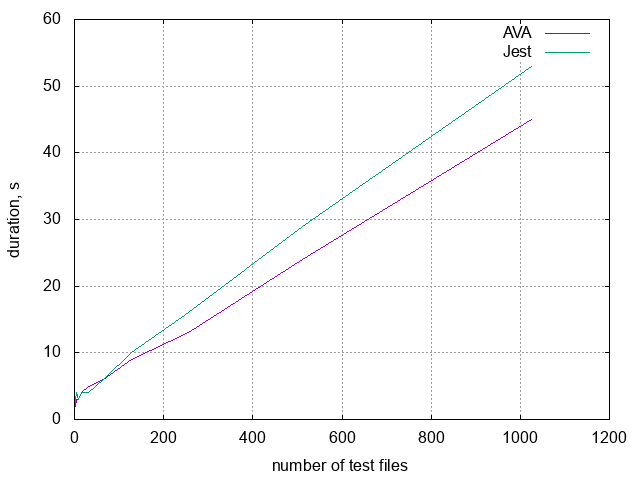
| files | AVA | Jest |
| ----- | --- | ---- |
| 1     | 2   | 2    |
| 2     | 2   | 3    |
| 4     | 3   | 4    |
| 8     | 3   | 3    |
| 16    | 4   | 4    |
| 32    | 5   | 4    |
| 64    | 6   | 6    |
| 128   | 9   | 10   |
| 256   | 13  | 16   |
| 512   | 24  | 29   |
| 1024  | 45  | 53   |


### max mean memory used per file

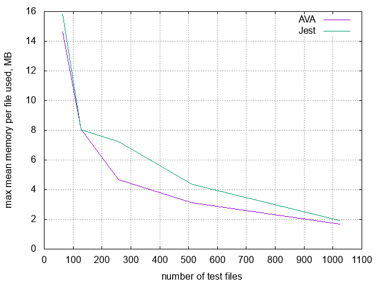
| files | AVA                      | Jest                     |
| ----- | ------------------------ | ------------------------ |
| 1     | 134.73800000000000000000 | 135.71900000000000000000 |
| 2     | 195.08400000000000000000 | 200.58800000000000000000 |
| 4     | 138.93650000000000000000 | 139.27450000000000000000 |
| 8     | 69.53325000000000000000  | 73.98925000000000000000  |
| 16    | 37.77906250000000000000  | 39.60812500000000000000  |
| 32    | 22.34325000000000000000  | 24.34437500000000000000  |
| 64    | 14.62634375000000000000  | 15.83429687500000000000  |
| 128   | 8.06695312500000000000   | 8.05542187500000000000   |
| 256   | 4.67807031250000000000   | 7.24246093750000000000   |
| 512   | 3.13617773437500000000   | 4.36254882812500000000   |
| 1024  | 1.69567089843750000000   | 1.91494726562500000000   |


### mean duration per file


| files | AVA                    | Jest                   |
| ----- | ---------------------- | ---------------------- |
| 1     | 2.00000000000000000000 | 2.00000000000000000000 |
| 2     | 1.00000000000000000000 | 1.50000000000000000000 |
| 4     | .75000000000000000000  | 1.00000000000000000000 |
| 8     | .37500000000000000000  | .37500000000000000000  |
| 16    | .25000000000000000000  | .25000000000000000000  |
| 32    | .15625000000000000000  | .12500000000000000000  |
| 64    | .09375000000000000000  | .09375000000000000000  |
| 128   | .07031250000000000000  | .07812500000000000000  |
| 256   | .05078125000000000000  | .06250000000000000000  |
| 512   | .04687500000000000000  | .05664062500000000000  |
| 1024  | .04394531250000000000  | .05175781250000000000  |


## one file with many tests

### search for maximum number of tests

#### maximum number of tests per max-old-space-size

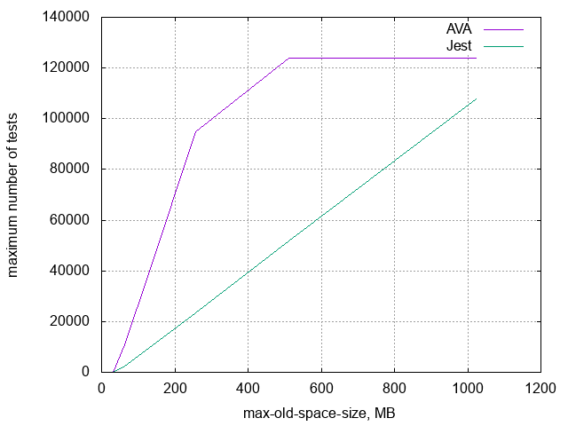
| memory | AVA    | Jest   |
| ------ | ------ | ------ |
| 8      | 1      | 1      |
| 16     | 1      | 1      |
| 32     | 1      | 1      |
| 64     | 10742  | 2442   |
| 128    | 38817  | 9521   |
| 256    | 94970  | 23437  |
| 512    | 123778 | 51757  |
| 1024   | 123778 | 107909 |


#### time to run maximum number of tests

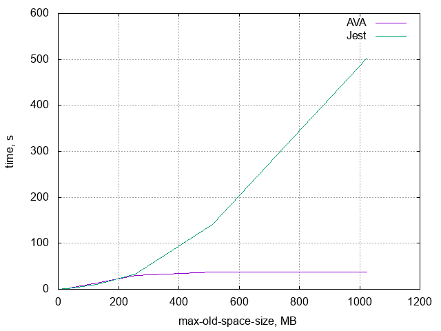
| memory | AVA | Jest |
| ------ | --- | ---- |
| 8      | 0   | 0    |
| 16     | 1   | 1    |
| 32     | 1   | 1    |
| 64     | 6   | 5    |
| 128    | 13  | 11   |
| 256    | 30  | 33   |
| 512    | 37  | 141  |
| 1024   | 37  | 503  |


#### memory per single test, >=64MB

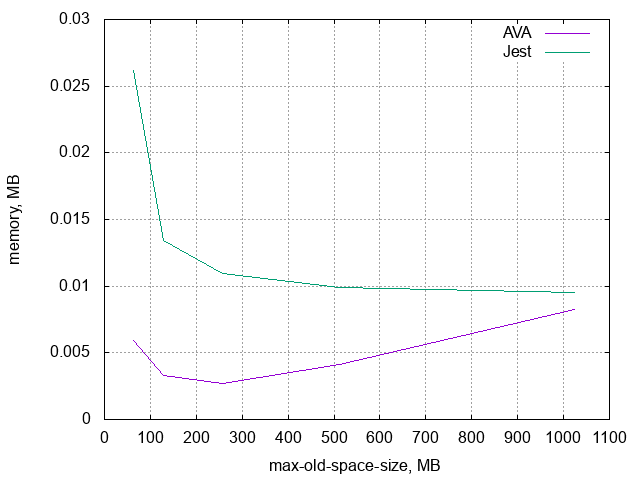
| memory | AVA                     | Jest                    |
| ------ | ----------------------- | ----------------------- |
| 8      | 8.00000000000000000000  | 8.00000000000000000000  |
| 16     | 16.00000000000000000000 | 16.00000000000000000000 |
| 32     | 32.00000000000000000000 | 32.00000000000000000000 |
| 64     | .00595792217464159374   | .02620802620802620802   |
| 128    | .00329752428059870675   | .01344396596996113853   |
| 256    | .00269558808044645677   | .01092289968852668856   |
| 512    | .00413643781609009678   | .00989238170682226558   |
| 1024   | .00827287563218019357   | .00948947724471545468   |


#### time per single test, >=64MB


| memory | AVA                    | Jest                   |
| ------ | ---------------------- | ---------------------- |
| 8      | 0                      | 0                      |
| 16     | 1.00000000000000000000 | 1.00000000000000000000 |
| 32     | 1.00000000000000000000 | 1.00000000000000000000 |
| 64     | .00055855520387264941  | .00204750204750204750  |
| 128    | .00033490480974830615  | .00115534082554353534  |
| 256    | .00031588922817731915  | .00140803003797414344  |
| 512    | .00029892226405338590  | .00272426918098035048  |
| 1024   | .00029892226405338590  | .00466133501376159541  |


### memory usage plot

When max-old-space-size is 512MB.
AVA on the left, Jest on the right. 

#### 10000

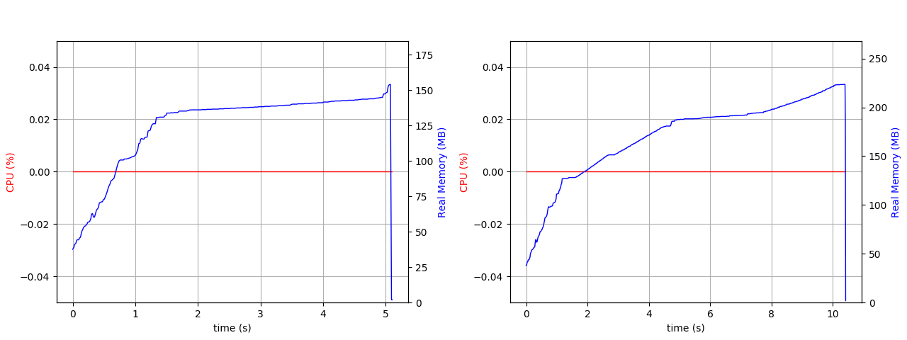

#### 25000


#### 50000

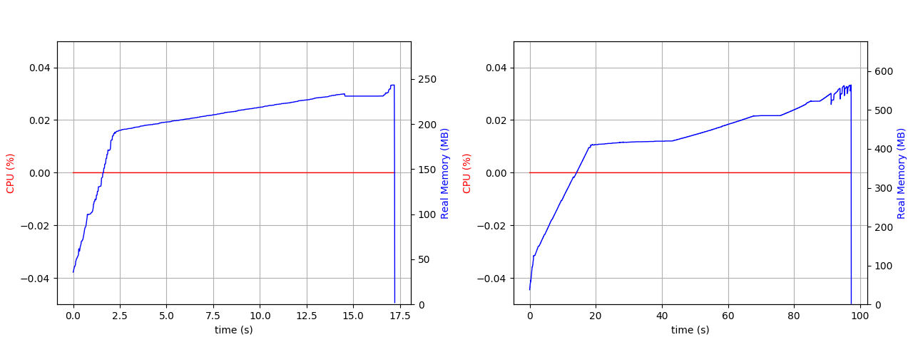

#### 51757 (max for Jest)


#### 123778 (max for AVA)


### time to run

When max-old-space-size is 512MB.


| tests  | AVA | Jest |
| ------ | --- | ---- |
| 10000  | 5   | 11   |
| 25000  | 10  | 37   |
| 50000  | 18  | 98   |
| 51757  | -   | 128  |
| 123778 | 40  | -    |


